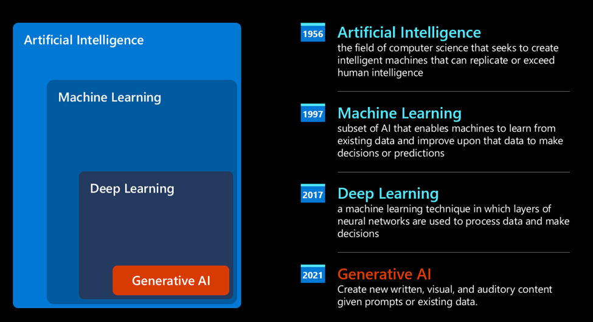
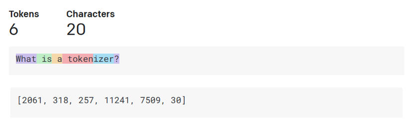
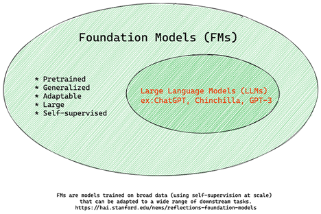
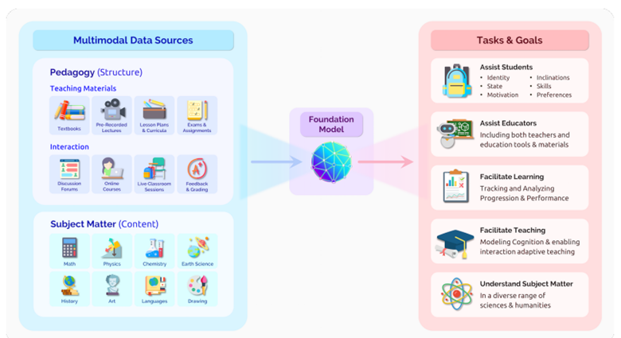
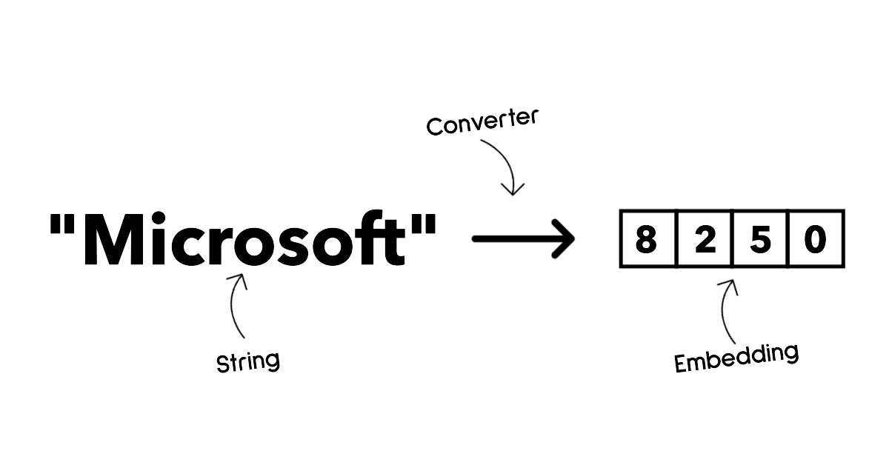
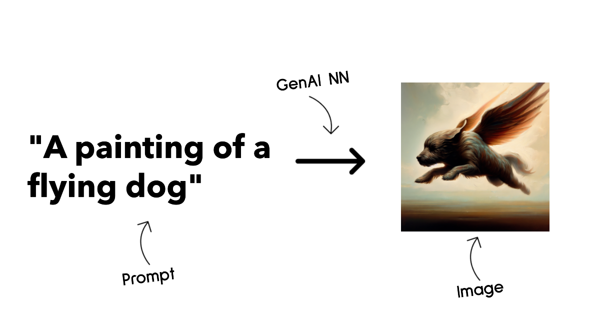
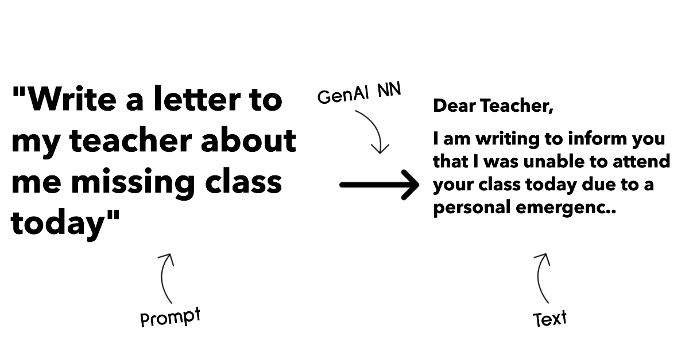
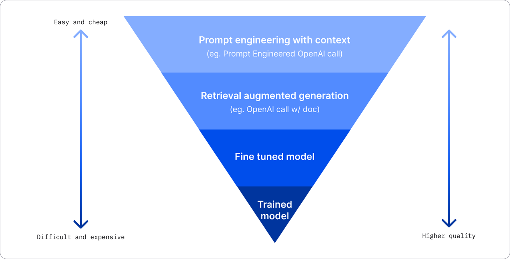
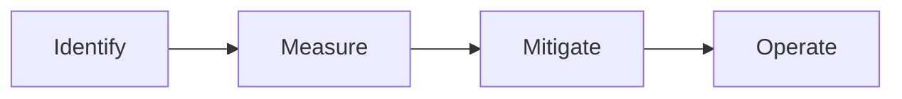
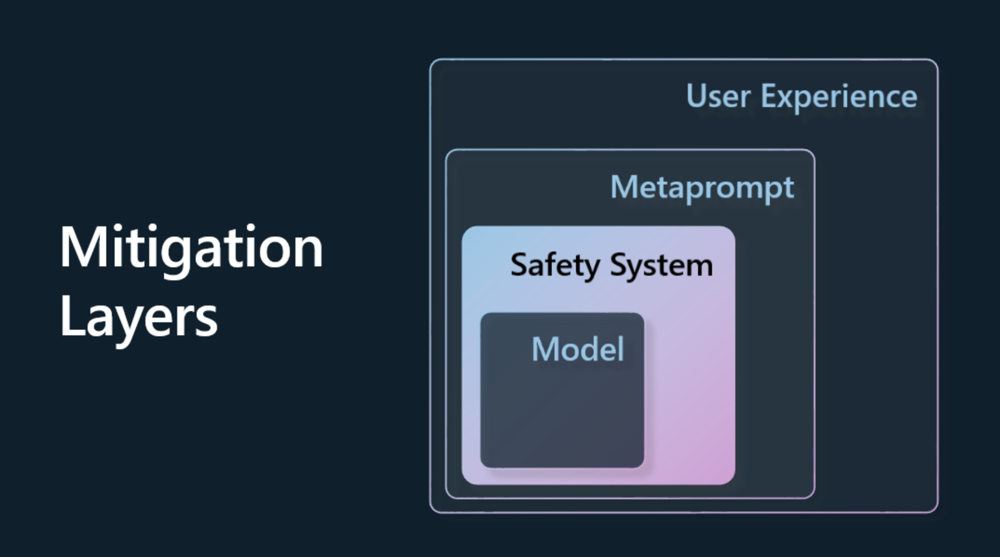

This post provides the snippets taken from the Generative AI course designed by Microsoft.
The course is available for free in [GitHub](https://microsoft.github.io/generative-ai-for-beginners/#/).

 Part - 01 

## 01	Introduction to Generative AI and LLMs

### How did we get Generative AI?

### How do large language models work?
- Tokenizer, text to numbers
- Predicting output tokens
- Selection process, probability distribution

#### Knowledge Check

1. What's true about large language models?

- a. You get the exact same response every time.
- b. It does things perfectly, great at adding numbers, produce working code etc.
- c. The response may vary despite using the same prompt. It's also great at giving you a first draft of something, be it text or code. But you need to improve on the results.

  
Click here to check your Answer

  Correct Answer is Option 'c'

---

## 02	Exploring and comparing different LLMs

### Understand different types of LLMs

LLMs can have multiple categorizations based on their architecture, training data, and use case.

- **Audio and speech recognition.** For this purpose, Whisper-type models are a great choice as they're general-purpose and aimed at speech recognition. It's trained on diverse audio and can perform multilingual speech recognition. Learn more about [Whisper type models here.](https://platform.openai.com/docs/models/whisper?WT.mc_id=academic-105485-koreyst)

- **Image generation.** For image generation, DALL-E and Midjourney are two very known choices. DALL-E is offered by Azure OpenAI. Read more about [DALL-E here.](https://platform.openai.com/docs/models/dall-e?WT.mc_id=academic-105485-koreyst)
  
- **Text generation.** Most models are trained on text generation and you have a large variety of choices from GPT-3.5 to GPT-4. They come at different costs with GPT-4 being the most expensive. It's worth looking into the [Azure OpenAI playground](https://oai.azure.com/portal/playground?WT.mc_id=academic-105485-koreyst) to evaluate which models best fit your needs in terms of capability and cost.

- **Multi-modality.** If you're looking to handle multiple types of data in input and output, you might want to look into models like [gpt-4 turbo with vision or gpt-4o](https://learn.microsoft.com/azure/ai-services/openai/concepts/models#gpt-4-and-gpt-4-turbo-models?WT.mc_id=academic-105485-koreyst) - the latest releases of OpenAI models - which are capable to combine natural language processing to visual understanding, enabling interactions through multi-modal interfaces.

### Foundation Models versus LLMs
- FMs are trained using unsupervised learning or self-supervised learning
- FMs are very large models with  billions of parameters.
- FMs are normally intended to serve as a ‘foundation’ for other models, meaning they can be used as a starting point for other models to be built on top of, which can be done by fine-tuning.

Example: OpenAI used some chat-specific data to create a tuned version of GPT-3.5 that was specialized in performing well in conversational scenarios, such as chatbots.

### Open Source versus Proprietary Models

- Open-source models are models that are made available to the public and can be used by anyone.
- These models are allowed to be inspected, modified, and customized for the various use cases in LLMs. 
- Examples of popular open source models include Alpaca, Bloom and LLaMA.

- Proprietary models are models that are owned by a company and are **not** made available to the public. 
- These models are often optimized for production use. 
- These models require a subscription or payment to use. 
- Users do not have control over the data that is used to train the model.
- Examples of popular proprietary models include OpenAI models, Google Bard or Claude 2.

### Embedding versus Image generation versus Text and Code generation

Example: OpenAI Embeddings

Example: DALL-E-3 and Stable Diffusion models

Example: CodeParrot

### Encoder-Decoder versus Decoder-only

- Examples of Decoder models are GPT family models, such as GPT-3. (Like a quiz content creator)
- Example of Encoder only model would be BERT. (Like a Quiz Reviewer)
- Examples of Encode-Decoder models would be BART and T5. (Someone who can create and review the quiz)

### Improving LLM results

- Prompt engineering with context. 
- Retrieval Augmented Generation, RAG.
- Fine-tuned model.
- Trained model. 

#### Knowledge check
What could be a good approach to improve LLM completion results?

- a. Prompt engineering with context
- b. RAG
- c. Fine-tuned model

  
Click here to check your Answer

  Correct Answer is Option 'a.'

---

## 03	Using Generative AI Responsibly

### Responsible AI Principles
- Fairness, 
- Inclusiveness, 
- Reliability/Safety,
- Security & Privacy,
- Transparency and Accountability.

### Why Should You Prioritize Responsible AI

#### 1. Hallucinations
Hallucinations are a term used to describe when an LLM produces content that is either completely nonsensical or something we know is factually wrong based on other sources of information.

#### 2. Harmful Content
- Providing instructions or encouraging self-harm or harm to certain groups.
- Hateful or demeaning content.
- Guiding planning any type of attack or violent acts.
- Providing instructions on how to find illegal content or commit illegal acts.
- Displaying sexually explicit content.

#### 3. Lack of Fairness
Ensuring that an AI system is free from bias and discrimination and that they treat everyone fairly and equally.

### How to Use Generative AI Responsibly?

- Choosing the right model for the right use case. 
- A safety system is a set of tools and configurations on the platform serving the model that help mitigate harm. 
- Metaprompts and grounding are ways we can direct or limit the model based on certain behaviors and information. 
- The final layer is where the user interacts directly with the model through our application’s interface in some way.
- We should always evaluate the model’s performance and outputs. It’s still important to measure the model’s accuracy, similarity, groundedness, and relevance of the output. 

#### Knowledge check
What are some things you need to care about to ensure responsible AI usage?

- a. That the answer is correct.
- b. Harmful usage, that AI isn't used for criminal purposes.
- c. Ensuring the AI is free from bias and discrimination.

  
Click here to check your Answer

  Correct Answer is Option 'b and c.'

---

## 04	Understanding Prompt Engineering Fundamentals

### What is Prompt Engineering?
Prompt Engineering as the process of designing and optimizing text inputs (prompts) to deliver consistent and quality responses (completions) for a given application objective and model.

We can think of this as a 2-step process:

- *designing* the initial prompt for a given model and objective.
- *refining* the prompt iteratively to improve the quality of the response.

This is necessarily a trial-and-error process that requires user intuition and effort to get optimal results. 

### Tokenization
An LLM sees prompts as a sequence of tokens where different models (or versions of a model) can tokenize the same prompt in different ways. 

### Foundation Models
Once a prompt is tokenized, the primary function of the "Base LLM" (or Foundation model) is to predict the token in that sequence.

### Instruction Tuned LLMs
An Instruction Tuned LLM starts with the foundation model and fine-tunes it with examples or input/output pairs (e.g., multi-turn "messages") that can contain clear instructions - and the response from the AI attempt to follow that instruction. This uses techniques like Reinforcement Learning with Human Feedback (RLHF).

### Why do we need Prompt Engineering?
1. Model responses are stochastic.
2. Models can fabricate responses.
3. Models capabilities will vary.

Examples:
1. Prompt: generate a lesson plan on the Martian War of 2076.

### Prompt Construction

